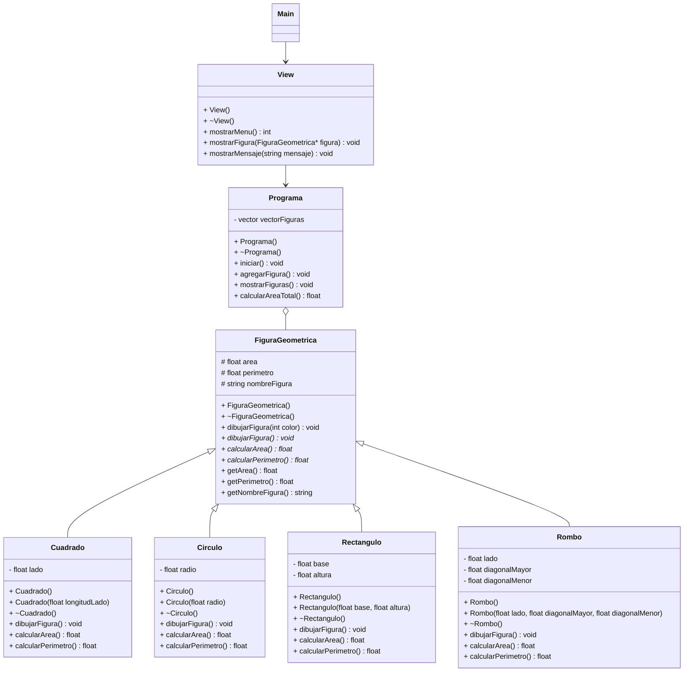

# Solución ejercicio de Figuras Geométricas que utiliza herencia, polimorfismo y clases abstractas
>Solución creada por Carlos Camacho y Sebastian Camaño en el 2022-1 y modificada por Luisa Rincón en el 2026-1 para volverla una guía de aprendizaje. 

# Guía de exploración: herencia y polimorfismo con figuras geométricas en C++

## 1. ¿Qué vamos a hacer?

En esta guía vas a explorar un proyecto en C++ que modela figuras geométricas. El proyecto incluye figuras como cuadrado, círculo, rectángulo y rombo. Todas tienen algunas cosas en común: se pueden dibujar, tienen área, tienen perímetro y tienen un nombre. Al mismo tiempo, cada figura calcula su área y su perímetro de manera diferente.

La guía está pensada para que avances con calma. Primero vas a mirar qué hace el programa, luego vas a revisar el diseño, después vas a leer algunas clases y al final harás una pequeña modificación.

El foco está en tres ideas importantes de programación orientada a objetos:

* **Herencia:** una clase puede tomar atributos y métodos de otra clase más general.
* **Polimorfismo:** diferentes objetos pueden responder al mismo mensaje de formas distintas.
* **Clase abstracta:** una clase puede definir métodos obligatorios para sus clases hijas.

---

## 2. Antes de empezar

Para aprovechar mejor esta guía, deberías recordar al menos estas ideas:

* qué es una clase;
* qué es un objeto;
* qué son atributos y métodos;
* cómo se separan archivos `.h` y `.cpp`;
* qué es un constructor;
* qué es un apuntador;
* cómo funciona de forma básica un `vector`.

No necesitas dominar herencia ni polimorfismo antes de iniciar. Justamente esta guía te ayudará a familiarizarte con esos conceptos usando un proyecto ya construido.

---

## 3. Ruta de trabajo

Trabajaremos en este orden:

1. Ejecutar el programa y observarlo.
2. Revisar la estructura del proyecto.
3. Leer el diagrama UML.
4. Estudiar la clase base `FiguraGeometrica`.
5. Revisar una figura concreta: `Cuadrado`.
6. Comparar otras figuras.
7. Entender el uso de `vector<FiguraGeometrica*>`.
8. Agregar una figura nueva: `TrianguloRectangulo`.

La recomendación es responder las actividades en un archivo de notas. Escribe respuestas cortas, pero con tus propias palabras.

---

## 4. Primer recorrido: ejecuta el programa

### Objetivo

Antes de leer el código, observa cómo se comporta el programa. Esto te dará una idea clara de lo que luego vas a encontrar en las clases.

### Pasos

1. Abre el proyecto en tu entorno de desarrollo.
2. Compila el proyecto.
3. Ejecuta el programa.
4. Revisa las opciones del menú.
5. Agrega al menos tres figuras diferentes.
6. Calcula áreas y perímetros.
7. Dibuja las figuras disponibles.
8. Calcula la suma total de áreas.

### Actividad corta

Responde:

1. ¿Qué acciones permite hacer el programa con las figuras?
2. ¿Qué datos pide para crear un cuadrado, un círculo y un rectángulo?
3. ¿Qué tienen en común todas las figuras que probaste?

### Idea para recordar

El programa trabaja con figuras distintas, pero les pide comportamientos similares: dibujarse, calcular área y calcular perímetro. Esa idea será importante cuando revisemos la clase base.

---

## 5. Mira la estructura del proyecto

### Objetivo

Ubicar los archivos principales antes de abrir muchas clases al mismo tiempo.

### Archivos y carpetas que debes encontrar

Busca en el proyecto:

* `Main.cpp`
* carpeta `Model`
* carpeta `View`
* clase `FiguraGeometrica`
* clases `Cuadrado`, `Circulo`, `Rectangulo` y `Rombo`
* clase `Programa`
* clase `View`

### Actividad corta

Completa la tabla:

| Clase              | ¿Qué elemento del problema modela? | ¿Qué responsabilidad tiene en el código?|
| ------------------ | ------------------------ | -------------------- |
| `FiguraGeometrica` | Representa la idea general de una figura geométrica.                         |  Define atributos y métodos comunes para todas las figuras.                    |
| `Cuadrado`         |                          |                      |
| `Circulo`          |                          |                      |
| `Rectangulo`       |                          |                      |
| `Rombo`            |                          |                      |
| `Programa`         |                          |                      |
| `View`             |                          |                      |

### Pista

`View` se relaciona con la interacción con el usuario. `Programa` se relaciona con la colección de figuras. Las clases de figuras están en el modelo del proyecto.

---

## 6. Revisa el UML del proyecto

### Objetivo

Entender el diseño antes de entrar al detalle del código.

En el diagrama UML vas a encontrar una clase general llamada `FiguraGeometrica`. De ella heredan varias clases: `Cuadrado`, `Circulo`, `Rectangulo` y `Rombo`.

La relación se puede leer así:

| Relación                                  | Lectura                                             |
| ----------------------------------------- | --------------------------------------------------- |
| `Cuadrado` hereda de `FiguraGeometrica`   | Un cuadrado es una figura geométrica.               |
| `Circulo` hereda de `FiguraGeometrica`    | Un círculo es una figura geométrica.                |
| `Rectangulo` hereda de `FiguraGeometrica` | Un rectángulo es una figura geométrica.             |
| `Rombo` hereda de `FiguraGeometrica`      | Un rombo es una figura geométrica.                  |
| `Programa` contiene figuras geométricas   | El programa guarda varias figuras en una colección. |
| `View` usa `Programa`                     | La vista usa el programa para ejecutar acciones.    |

### Actividad corta

Dibuja en tu cuaderno o en una herramienta digital una versión sencilla del UML. Incluye solamente:

* `FiguraGeometrica`;
* las cuatro figuras hijas;
* `Programa`;
* `View`.

Usa flechas para mostrar qué clases heredan y qué clases se usan entre sí.

---

## 7. La clase base `FiguraGeometrica`

### Objetivo

Entender por qué esta clase es el punto de partida del diseño.

Abre el archivo `FiguraGeometrica.h` y ubica estos elementos:

```cpp
protected:
    float area;
    float perimetro;
    string nombreFigura;
```

Estos atributos están en la clase base porque todas las figuras pueden tener área, perímetro y nombre. Al estar en `protected`, las clases hijas pueden usarlos.

Ahora ubica estos métodos:

```cpp
virtual void dibujarFigura() = 0;
virtual float calcularArea() = 0;
virtual float calcularPerimetro() = 0;
```

El `= 0` indica que son métodos virtuales puros. Esto significa que las figuras hijas deben implementarlos.

También encontrarás métodos como:

```cpp
float getArea();
float getPerimetro();
string getNombreFigura();
```

Estos métodos permiten consultar información de la figura.

### Actividad corta

Completa:

| Elemento              | ¿Para qué sirve? |
| --------------------- | ---------------- |
| `area`                |                  |
| `perimetro`           |                  |
| `nombreFigura`        |                  |
| `calcularArea()`      |                  |
| `calcularPerimetro()` |                  |
| `dibujarFigura()`     |                  |

### Idea para recordar

`FiguraGeometrica` define lo que todas las figuras deben saber hacer. Cada figura concreta se encarga de implementar esos comportamientos con sus propios datos y fórmulas.

---

## 8. Primera figura: `Cuadrado`

### Objetivo

Leer una clase hija con guía detallada.

Abre `Cuadrado.h` y busca esta línea:

```cpp
class Cuadrado: public FiguraGeometrica
```

Esta línea indica que `Cuadrado` hereda de `FiguraGeometrica`.

Ahora identifica el atributo propio del cuadrado:

```cpp
private:
    float lado;
```

El lado pertenece al cuadrado porque sus cálculos dependen de ese dato.

Luego busca los métodos con `override`:

```cpp
void dibujarFigura() override;
float calcularArea() override;
float calcularPerimetro() override;
```

`override` indica que `Cuadrado` implementa métodos que la clase base había declarado.

### Ahora abre `Cuadrado.cpp`

Ubica:

* el constructor;
* el método `calcularArea()`;
* el método `calcularPerimetro()`;
* el método `dibujarFigura()`.

El área del cuadrado se calcula con:

```cpp
area = lado * lado;
```

El perímetro se calcula con:

```cpp
perimetro = lado * 4;
```

### Actividad corta

Si se crea un cuadrado de lado 8:

| Pregunta                                | Respuesta |
| --------------------------------------- | --------- |
| ¿Cuál debería ser su área?              |           |
| ¿Cuál debería ser su perímetro?         |           |
| ¿Qué atributo propio usa para calcular? |           |
| ¿Qué atributos heredados actualiza?     |           |

Ejecuta el programa y verifica.

---

## 9. Compara las otras figuras

### Objetivo

Reconocer el mismo patrón en varias clases hijas.

Ahora revisa `Rectangulo`, `Circulo` y `Rombo`. No necesitas leer cada línea con el mismo detalle que en `Cuadrado`. Busca el patrón.

Completa la tabla:

| Figura       | Atributos propios | Fórmula del área | Fórmula del perímetro | Métodos sobrescritos |
| ------------ | ----------------- | ---------------- | --------------------- | -------------------- |
| `Cuadrado`   |                   |                  |                       |                      |
| `Rectangulo` |                   |                  |                       |                      |
| `Circulo`    |                   |                  |                       |                      |
| `Rombo`      |                   |                  |                       |                      |

### Actividad corta

Responde:

1. ¿Qué métodos tienen en común todas las figuras?
2. ¿Qué cambia en cada figura?
3. ¿Por qué es útil que todas usen nombres de métodos iguales?

### Idea para recordar

Todas las figuras comparten una estructura común, pero cada una implementa sus cálculos de acuerdo con sus propios atributos.

---

## 10. El polimorfismo en `Programa`

### Objetivo

Entender cómo el proyecto puede guardar y procesar varias figuras usando una sola colección.

Abre `Programa.h` y busca el vector donde se almacenan las figuras:

```cpp
vector<FiguraGeometrica*> vectorFiguras;
```

Esta línea es clave. El vector guarda apuntadores a `FiguraGeometrica`, pero esos apuntadores pueden referirse a objetos concretos como `Cuadrado`, `Circulo`, `Rectangulo` o `Rombo`.

Por ejemplo, el programa puede guardar objetos creados así:

```cpp
new Cuadrado(...)
new Circulo(...)
new Rectangulo(...)
new Rombo(...)
```

Aunque cada objeto tiene una clase real distinta, todos pueden tratarse como figuras geométricas porque heredan de `FiguraGeometrica`.

### Revisa un recorrido del vector

Busca en `Programa.cpp` un ciclo donde se recorran las figuras para calcular área, perímetro o dibujarlas. Encontrarás una lógica parecida a esta:

```cpp
for(auto & figura : vectorFiguras){
    figura->calcularArea();
}
```

La variable `figura` es de tipo `FiguraGeometrica*`. Al llamar `calcularArea()`, C++ ejecuta la versión correspondiente según el objeto real.

Si el objeto real es un cuadrado, se ejecuta `Cuadrado::calcularArea()`.
Si el objeto real es un círculo, se ejecuta `Circulo::calcularArea()`.

### Actividad corta

Completa:

| Objeto guardado en el vector | Método que se ejecuta al llamar `calcularArea()` |
| ---------------------------- | ------------------------------------------------ |
| `new Cuadrado(...)`          |                                                  |
| `new Circulo(...)`           |                                                  |
| `new Rectangulo(...)`        |                                                  |
| `new Rombo(...)`             |                                                  |

### Idea para recordar

El polimorfismo permite recorrer todas las figuras con el mismo código. El programa envía el mismo mensaje y cada figura responde de acuerdo con su clase real.

---

## 11. Sobrescritura y sobrecarga

### Objetivo

Distinguir dos conceptos que aparecen en este proyecto.

### Sobrescritura

Ocurre cuando una clase hija implementa un método declarado en la clase base.

Ejemplo:

```cpp
class FiguraGeometrica {
public:
    virtual float calcularArea() = 0;
};

class Cuadrado : public FiguraGeometrica {
public:
    float calcularArea() override;
};
```

Aquí `Cuadrado` sobrescribe `calcularArea()`.

### Sobrecarga

Ocurre cuando varios métodos tienen el mismo nombre, pero reciben parámetros diferentes.

En `Programa` puedes encontrar varios métodos llamados `agregarFigura(...)` con firmas distintas.

Ejemplo:

```cpp
void agregarFigura(int lado);
void agregarFigura(float radio);
void agregarFigura(int base, int altura);
```

### Actividad corta

Clasifica:

| Caso                                         | ¿Sobrescritura o sobrecarga? |
| -------------------------------------------- | ---------------------------- |
| `Cuadrado` implementa `calcularArea()`       |                              |
| `Circulo` implementa `dibujarFigura()`       |                              |
| `Programa` tiene varios `agregarFigura(...)` |                              |
| `Rombo` implementa `calcularPerimetro()`     |                              |

---

## 12. Actividad práctica: agrega `TrianguloRectangulo`

### Objetivo

Crear una nueva figura siguiendo el diseño del proyecto.

Vas a agregar una clase llamada `TrianguloRectangulo`. Usaremos este tipo de triángulo porque permite calcular el área de forma sencilla usando base y altura.

La clase tendrá estos atributos propios:

* `base`
* `altura`
* `hipotenusa`

El área se calcula así:

```cpp
area = (base * altura) / 2;
```

El perímetro se calcula así:

```cpp
perimetro = base + altura + hipotenusa;
```

### Pasos

1. Crea `TrianguloRectangulo.h` en la carpeta `Model`.
2. Crea `TrianguloRectangulo.cpp` en la carpeta `Model`.
3. Haz que la clase herede de `FiguraGeometrica`.
4. Agrega sus atributos propios.
5. Implementa el constructor.
6. Asigna el nombre de la figura.
7. Implementa `dibujarFigura()`.
8. Implementa `calcularArea()`.
9. Implementa `calcularPerimetro()`.
10. Incluye la nueva clase en `Programa`.
11. Agrega una opción en `View` para crear el triángulo.
12. Ejecuta y prueba.

### Lista de chequeo

| Criterio                                                | Cumple |
| ------------------------------------------------------- | ------ |
| La clase hereda de `FiguraGeometrica`.                  |        |
| Usa `override` en los métodos sobrescritos.             |        |
| Calcula correctamente el área.                          |        |
| Calcula correctamente el perímetro.                     |        |
| Se puede crear desde el menú.                           |        |
| Se guarda en `vectorFiguras`.                           |        |
| Funciona al calcular áreas junto con las demás figuras. |        |

### Pregunta clave

Después de agregar `TrianguloRectangulo`, revisa el ciclo que calcula el área de todas las figuras.

¿Tuviste que modificar ese ciclo para que el triángulo funcionara? Explica brevemente tu respuesta.

---

## 13. Revisión rápida del código

Antes de cerrar, revisa el proyecto con ojos de programador. Busca al menos dos aspectos que puedan mejorarse.

Puedes fijarte en:

* nombres de variables o métodos;
* mensajes que se imprimen al usuario;
* uso de `new` y destructores;
* fórmulas usadas;
* repetición de código;
* claridad del menú;
* uso de `const` en métodos que no modifican el objeto.

Completa:

| Observación | Archivo | Propuesta de mejora |
| ----------- | ------- | ------------------- |
|             |         |                     |
|             |         |                     |

---

## 14. Cierre de la guía

Para cerrar, escribe una explicación breve, de máximo 10 líneas, donde le cuentes a otro estudiante cómo funciona el polimorfismo en este proyecto.

Incluye estas ideas:

* qué representa `FiguraGeometrica`;
* qué hacen las clases hijas;
* por qué el vector usa `FiguraGeometrica*`;
* qué ocurre cuando se llama `calcularArea()`;
* qué aprendiste al agregar `TrianguloRectangulo`.

---

## 15. Entrega sugerida

Entrega un documento corto con:

1. La tabla de clases del proyecto.
2. La tabla comparativa de figuras.
3. La clasificación de sobrecarga y sobrescritura.
4. La evidencia de que agregaste `TrianguloRectangulo`.
5. La respuesta a la pregunta clave sobre el ciclo polimórfico.
6. La explicación final de máximo 10 líneas.

---

## 16. Lista final de autoevaluación

Marca tu avance:

| Criterio                                           | Sí | Parcialmente | Necesito repasar |
| -------------------------------------------------- | -- | ------------ | ---------------- |
| Identifico la clase base del proyecto.             |    |              |                  |
| Reconozco las clases hijas.                        |    |              |                  |
| Entiendo qué significa `override`.                 |    |              |                  |
| Entiendo qué significa un método virtual puro.     |    |              |                  |
| Explico cómo funciona `vector<FiguraGeometrica*>`. |    |              |                  |
| Diferencio sobrecarga y sobrescritura.             |    |              |                  |
| Puedo agregar una nueva figura al proyecto.        |    |              |                  |
| Puedo explicar el polimorfismo con este ejemplo.   |    |              |                  |


>>

El siguiente es un software capaz de manipular figuras geométricas de cuatro tipos: cuadrado, círculo, rectángulo y rombo

Esta solución responde al enunciado propuesto en: https://github.com/300CIS017-Object-Oriented-Programming/EjercicioHerenciaFigurasGeometricas

## Caracteristicas

1. El sistema almacena figuras geométricas de los tres tipos disponibles, según parámetros ingresados por el usuario.
2. El sistema dibuja la figura geométrica según cada tipo.
3. El sistema calcula y muestra el área correspondiente según el tipo de figura geométrica agregada.
4. El sistema calcula y muestra el perímetro correspondiente según el tipo de figura geométrica agregada.
5. El sistema suma y muestra el total de las áreas de cada figura agregada.

## Link UML

