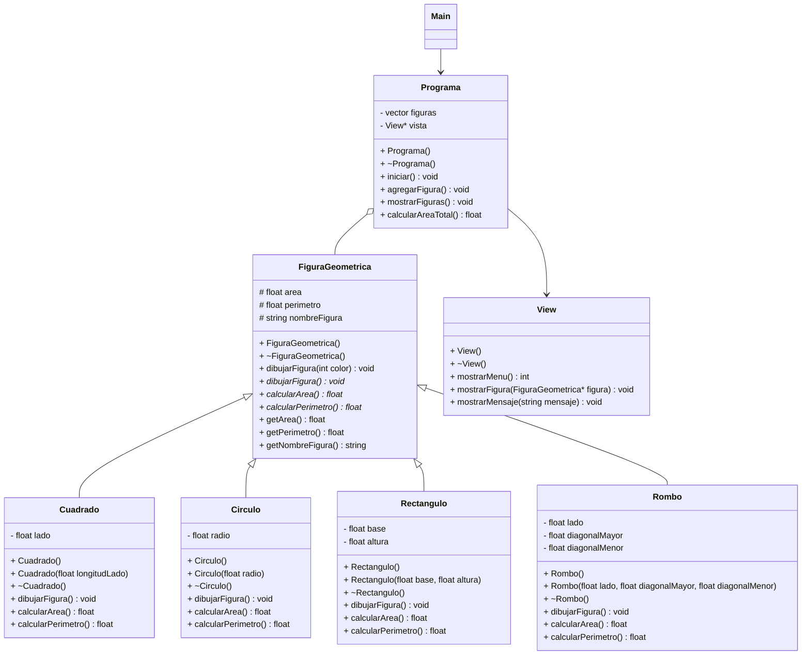

# Solución ejercicio de Figuras Geométricas que utiliza herencia, polimorfismo y clases abstractas
>Solución creada por Carlos Camacho y Sebastian Camaño en el 2022-1 y modificada por Luisa Rincón

# Introducción

El siguiente es un software capaz de manipular figuras geométricas de cuatro tipos: cuadrado, círculo, rectángulo y rombo

Esta solución responde al enunciado propuesto en: https://github.com/300CIS017-Object-Oriented-Programming/EjercicioHerenciaFigurasGeometricas

## Caracteristicas

1. El sistema almacena figuras geométricas de los tres tipos disponibles, según parámetros ingresados por el usuario.
2. El sistema dibuja la figura geométrica según cada tipo.
3. El sistema calcula y muestra el área correspondiente según el tipo de figura geométrica agregada.
4. El sistema calcula y muestra el perímetro correspondiente según el tipo de figura geométrica agregada.
5. El sistema suma y muestra el total de las áreas de cada figura agregada.

## Link UML

https://drive.google.com/file/d/1FRbCijspFYxBS0EdT0Flei9XwwCLBICp/view?usp=sharing
